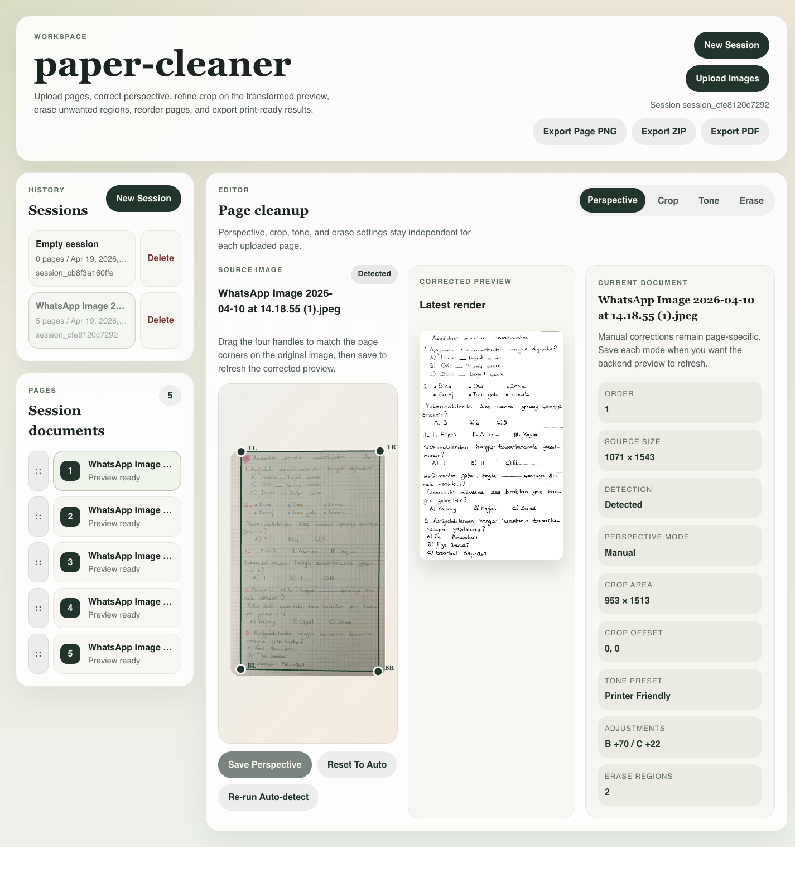
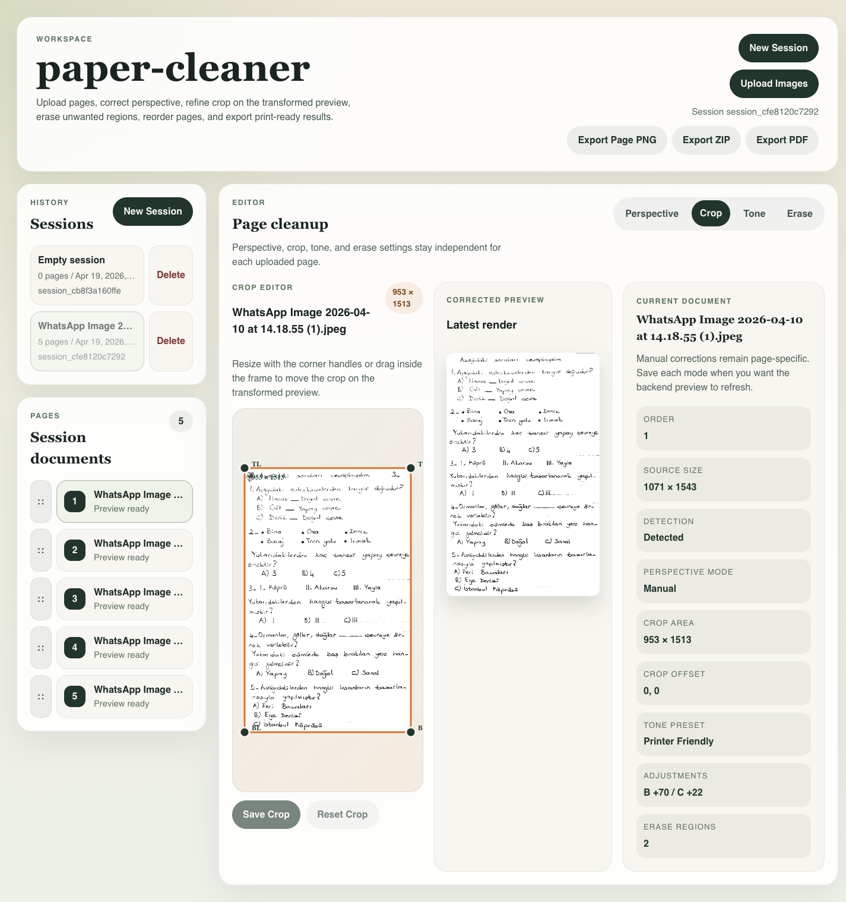
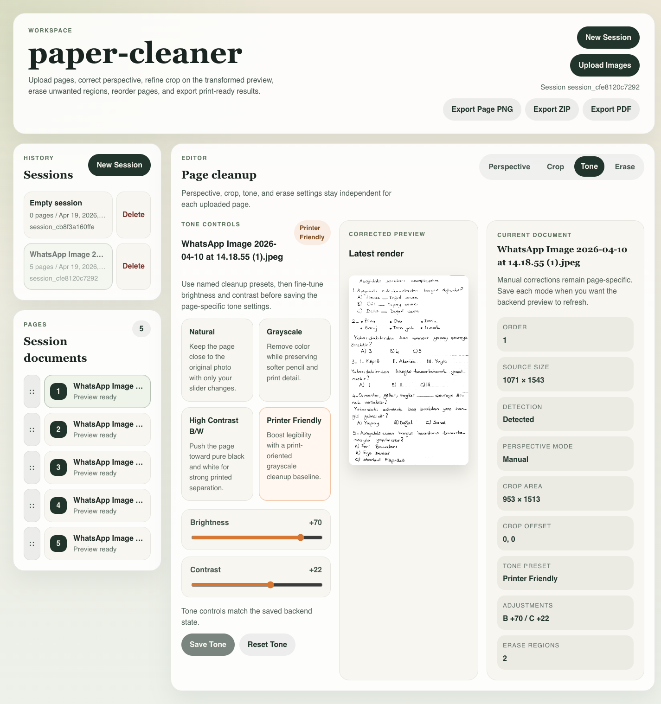
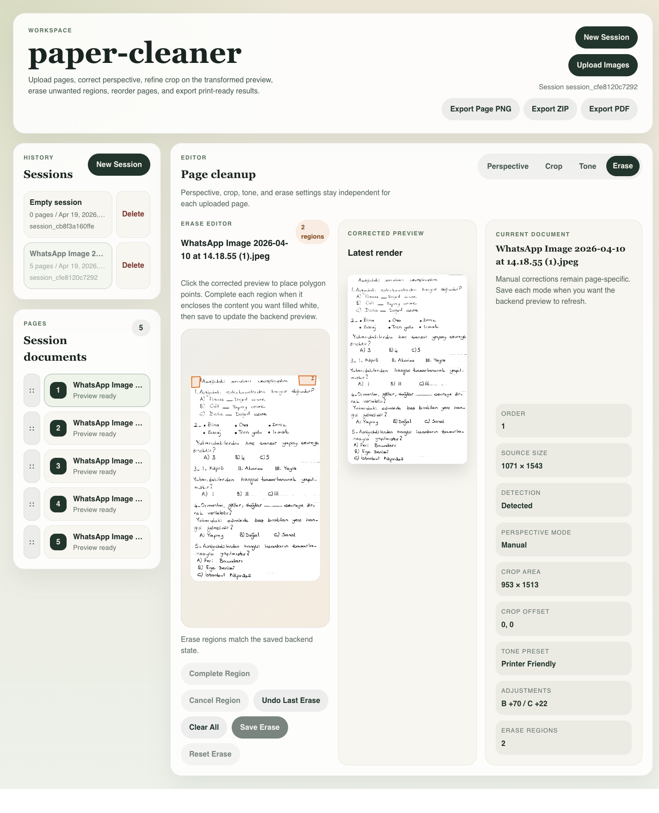

# paper-cleaner

paper-cleaner is a local document cleaning and print-preparation tool for worksheet-like images. It is meant for phone photos, screenshots, and other imperfect captures where a user needs to correct perspective, crop, improve printability, remove manually selected regions, reorder pages, and export the result.

The app is intentionally local-first and simple. It does not include accounts, authentication, OCR, cloud storage, analytics, background workers, or extra service dependencies.

## Screenshots

Full-page workspace overview with a loaded multi-page session:



Full-page crop, tone, and manual erase views:







## Run With Docker

Requirements:

- Docker
- Docker Compose

Start the packaged app:

```sh
docker compose up --build
```

Open:

```text
http://localhost:8000
```

The production container builds the Vite frontend, copies the static assets into the FastAPI backend, and serves both the API and frontend from one container on port `8000`.

## Data Persistence

The compose file mounts local runtime data into the container:

```text
./data:/app/data
```

Uploaded originals, rendered previews/exports, temporary files, and JSON metadata are stored under `data/`. Original uploaded files are not overwritten; edits are stored as metadata and reapplied for previews and exports.

## Basic Usage

1. Upload one or more images.
2. Select each page independently from the page list.
3. Adjust perspective corners when auto-detection needs correction.
4. Adjust crop, tone preset, brightness, and contrast.
5. Use the erase tool to manually draw regions that should be filled white.
6. Reorder pages as needed.
7. Export a single page image, a ZIP archive, or an ordered PDF.

Each image has independent settings. The app does not assume that edits for one page should automatically apply to another page.

## Local Development

Run the backend:

```sh
cd backend
python3.14 -m venv .venv
source .venv/bin/activate
pip install -r requirements.txt -r requirements-dev.txt
uvicorn app.main:app --reload --host 0.0.0.0 --port 8000
```

Run the frontend in a separate terminal:

```sh
cd frontend
corepack enable
pnpm install --frozen-lockfile
pnpm dev
```

The Vite development server proxies API requests to the FastAPI backend.

## Verification Commands

Useful checks before packaging or review:

```sh
docker compose config
cd frontend && pnpm build
docker compose build
```

After starting the container, check the app shell at `http://localhost:8000` and the health endpoint at `http://localhost:8000/api/health`.
